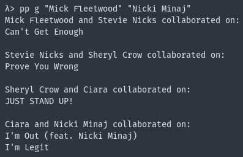

# (feat. Chains)

Perform a BFS of the Spotify API where nodes are artists, and edges are collaborations on songs, in order to build the graph of collaborating artists. Scrapes about 20 artists per second.

Written up in Haskell. Currently in exploratory, single-file scripting phase. Supports scraping and finding chains of artists in reasonable time.

Typical output:

## Requirements

- postgresql set up with local DB "featchains"
- API secret stored in file in root dir called "secret"
